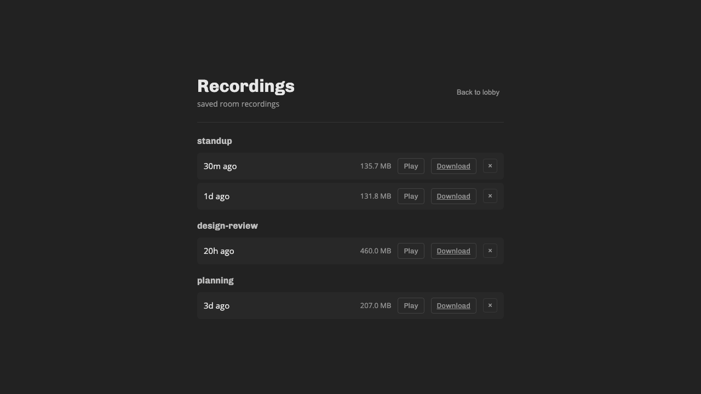
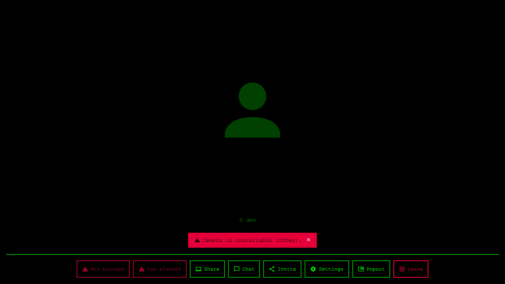

# boom

Video conferencing with end-to-end encryption, powered by LiveKit.




Themeable — switch from the Settings modal:



## Features

- GitHub OAuth authentication with allowlist (usernames and/or org membership)
- Room lobby — browse active rooms with participant counts, create and join rooms
- Themes — swap the whole visual system (colors, fonts, shapes, motion) via the Settings modal; ships with Classic and a Terminal CRT theme, driven by `[data-theme]` tokens
- Aspect-aware tile packing — each tile sized to its stream's native aspect ratio, packed tightly with no grid
- Pin mode — pin tiles to split the view with a resizable divider, both halves independently packed
- Fullscreen video — click to watch a single stream in native fullscreen (Escape to exit)
- Screen sharing with native aspect ratio preserved
- Chat panel with unread message badge, multi-line input, resizable sidebar
- Camera and microphone device switching
- GitHub avatars on video tiles when camera is off
- Session persistence across page refreshes (auto-reconnect with fresh token)
- Mobile responsive (container queries for icon-only controls, fullscreen chat overlay)
- Accessible error handling (inline banners, device permission states on buttons)
- Room recording via LiveKit Egress — start/stop from the control bar, list/play/download/delete from the lobby. Disk-space preflight and failure surfacing via LiveKit webhook

## Setup

Copy `.env.example` to `.env` and fill in the required values (LiveKit keys, GitHub OAuth, session secret, allowlist). `npm run generate-keys` prints freshly-generated LiveKit and session secrets you can paste in. Everything else — URLs, ports, paths — has sensible defaults documented in `.env.example`.

> **One networking gotcha for local dev**: need to set `LIVEKIT_NODE_IP=<your LAN IP>` in `.env` (e.g. `192.168.1.166`). LiveKit advertises this address to browsers as the WebRTC media endpoint. Loopback address `127.0.0.1` doesn't work as the browser can't usefully reach over UDP through Docker's port forwarding — ICE will fail and you'll be kicked from the room a few seconds after joining. This applies whether you're running the full stack in compose or boom on the host.

### Full stack (docker compose)

```bash
docker compose up -d --build
```

Boots boom, livekit, egress, and redis. App at `http://localhost:3000`.

Rebuild just boom after code changes:

```bash
docker compose up -d --build boom
```

### Local dev (boom on the host, rest in compose)

```bash
npm install
cp .env.example .env
docker compose up -d livekit egress redis
npm run dev
```

Vite HMR at `http://localhost:3000`. In dev mode a "continue in dev mode" link bypasses GitHub OAuth. The mid-session recording-failure webhook from LiveKit → boom won't reach a host-run boom from the livekit container; everything else works.

### Testing

```bash
npm test                      # Playwright e2e (needs dev server on :3000)
npm test -- --headed
npm test -- e2e/live.spec.ts
```

Screenshots land in `e2e/screenshots/`.

## How it works

Users sign in with GitHub. The server checks their username against the allowlist (and/or org membership). Authenticated users see a lobby of active rooms and can create or join rooms. The server issues a LiveKit JWT token for the chosen room.

## Future features

- **Virtual backgrounds** — MediaProcessor pipeline for background blur/replacement
- **Breakout rooms** — multiple LiveKit rooms with a coordination layer
- **Hand raising** — participant metadata flag + UI indicator
- **Reactions/emoji** — data channel broadcast of ephemeral reaction events
- **Noise cancellation** — Krisp noise cancellation via LiveKit's audio processor
- **Whiteboard** — shared canvas via data channels (tldraw/excalidraw integration)
- **Participant list with roles** — metadata-driven role display + moderation controls
