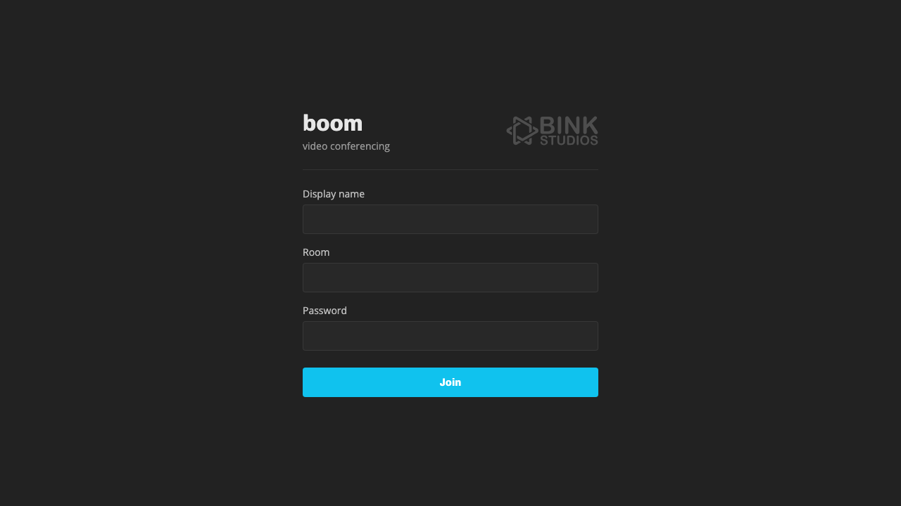
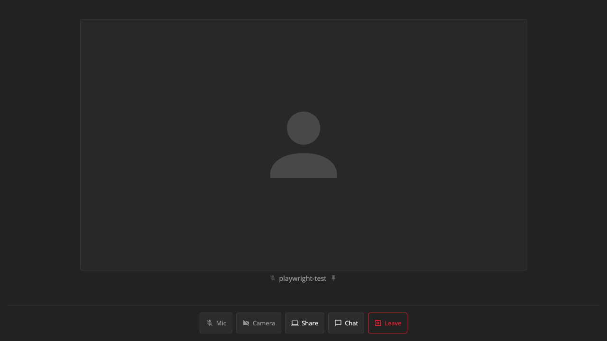
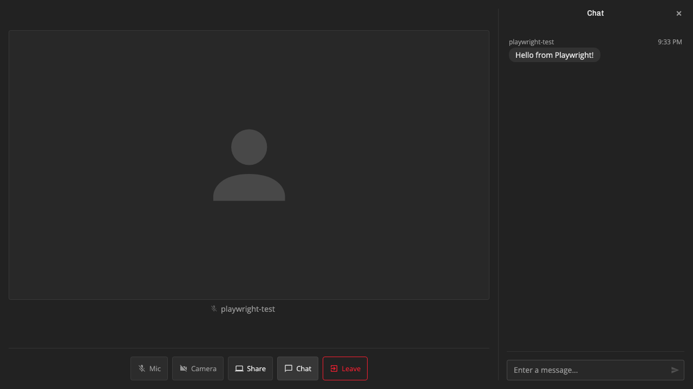

# boom

Video conferencing with end-to-end encryption, powered by LiveKit.







## Features

- Aspect-aware tile packing — each tile sized to its stream's native aspect ratio, packed tightly with no grid
- Pin mode — pin tiles to split the view with a resizable divider, both halves independently packed
- Fullscreen video — click to watch a single stream in native fullscreen (Escape to exit)
- Screen sharing with native aspect ratio preserved
- Chat panel with unread message badge, multi-line input, resizable sidebar
- Camera and microphone device switching
- End-to-end encryption (password-based shared key)
- Session persistence across page refreshes (auto-reconnect with fresh token)
- Mobile responsive (container queries for icon-only controls, fullscreen chat overlay)
- Accessible error handling (inline banners, device permission states on buttons)

## Setup

### Environment

Copy `.env.example` to `.env.local` and fill in your values:

```bash
LIVEKIT_API_KEY=...        # From your LiveKit server config
LIVEKIT_API_SECRET=...     # From your LiveKit server config
LIVEKIT_URL=wss://...      # Your LiveKit server WebSocket URL
BOOM_PASSWORD=...          # Shared password for room access + E2EE
PORT=3000                  # Server port (default 3000)
```

### Development

```bash
# Install dependencies
npm install

# Start the backend (in one terminal)
npm run dev:server

# Start the frontend (in another terminal)
npm run dev
```

The frontend runs on `http://localhost:5173` and proxies `/api` requests to the backend on port 3000. Both are accessible on your local network for testing on other devices.

### Testing

```bash
# Run all tests (needs dev servers running)
npm test

# Run with headed browser
npm test -- --headed

# Run only the live test (requires .env.local with valid credentials)
npm test -- e2e/live.spec.ts
```

Screenshots are saved to `e2e/screenshots/`.

### Production (Docker)

```bash
docker build -t boom .
docker run -p 3000:3000 --env-file .env.local boom
```

### Docker Compose

Add to your existing compose file alongside LiveKit:

```yaml
boom:
  build: .
  ports:
    - "3000:3000"
  environment:
    - LIVEKIT_API_KEY=${LIVEKIT_API_KEY}
    - LIVEKIT_API_SECRET=${LIVEKIT_API_SECRET}
    - LIVEKIT_URL=${LIVEKIT_URL}
    - BOOM_PASSWORD=${BOOM_PASSWORD}
```

## How it works

Users enter a display name, room name, and password. The server validates the password and issues a LiveKit JWT token. The client connects to the LiveKit room with E2E encryption using the password as the shared key — even the server cannot decrypt audio/video content.

## Future features

- **Recording** — server-side recording via LiveKit Egress API
- **Virtual backgrounds** — MediaProcessor pipeline for background blur/replacement
- **Breakout rooms** — multiple LiveKit rooms with a coordination layer
- **Hand raising** — participant metadata flag + UI indicator
- **Reactions/emoji** — data channel broadcast of ephemeral reaction events
- **Noise cancellation** — Krisp noise cancellation via LiveKit's audio processor
- **Whiteboard** — shared canvas via data channels (tldraw/excalidraw integration)
- **Participant list with roles** — metadata-driven role display + moderation controls
- **Picture-in-picture** — Browser PiP API for video tracks
- **Room list / lobby** — browse and join active rooms
