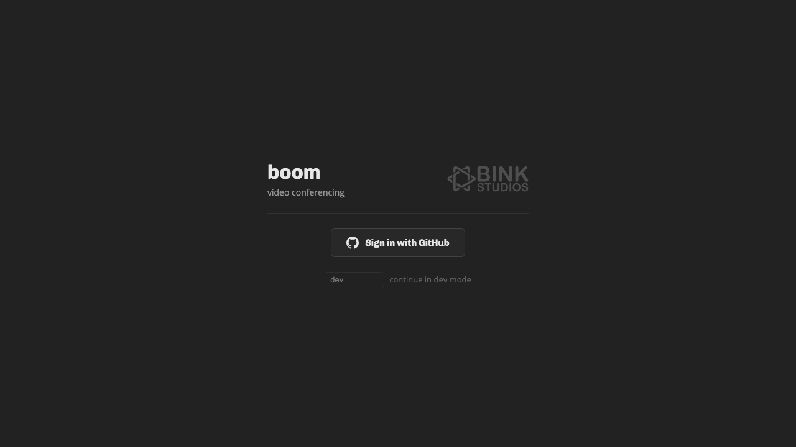
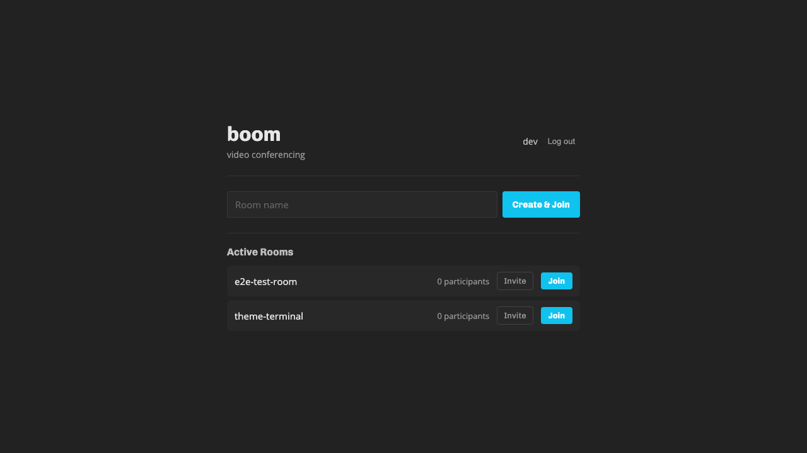

# boom

Video conferencing with end-to-end encryption, powered by LiveKit.






## Features

- **GitHub OAuth authentication** with allowlist (usernames and/or org membership)
- **Room lobby** — browse active rooms with participant counts, create and join rooms
- Aspect-aware tile packing — each tile sized to its stream's native aspect ratio, packed tightly with no grid
- Pin mode — pin tiles to split the view with a resizable divider, both halves independently packed
- Fullscreen video — click to watch a single stream in native fullscreen (Escape to exit)
- Screen sharing with native aspect ratio preserved
- Chat panel with unread message badge, multi-line input, resizable sidebar
- Camera and microphone device switching
- GitHub avatars on video tiles when camera is off
- Session persistence across page refreshes (auto-reconnect with fresh token)
- Mobile responsive (container queries for icon-only controls, fullscreen chat overlay)
- Accessible error handling (inline banners, device permission states on buttons)

## Setup

### Environment

Copy `.env.example` to `.env.local` and fill in your values:

```bash
LIVEKIT_API_KEY=...            # From your LiveKit server config
LIVEKIT_API_SECRET=...         # From your LiveKit server config
LIVEKIT_URL=wss://...          # Your LiveKit server WebSocket URL
PORT=3000                      # Server port (default 3000)

# GitHub OAuth (create at https://github.com/settings/developers)
# Callback URL: http://localhost:3000/api/auth/github/callback
GITHUB_CLIENT_ID=...
GITHUB_CLIENT_SECRET=...

# Access control — at least one must be set (fail closed if both empty)
BOOM_ALLOWED_USERS=alice,bob   # Comma-separated GitHub usernames
BOOM_ALLOWED_ORGS=my-org       # Comma-separated GitHub org slugs

# Random string for signing session cookies
BOOM_SESSION_SECRET=...
```

#### Generating a key pair

```bash
npm run generate-keys
```

Paste the output into `.env.local`.

### Development

```bash
npm install
npm run dev
```

The unified dev server runs on `http://localhost:3000` with Vite HMR.

In dev mode, a "continue in dev mode" link appears on the login page to bypass GitHub OAuth. You can specify a username via the input field.

### Testing

```bash
# Run all tests (needs dev server running on port 3000)
npm test

# Run with headed browser
npm test -- --headed

# Run only the live test
npm test -- e2e/live.spec.ts
```

Screenshots are saved to `e2e/screenshots/`.

### Production (Docker)

```bash
docker build -t boom .
docker run -p 3000:3000 --env-file .env.local boom
```

### Docker Compose

Add to your existing compose file alongside LiveKit:

```yaml
boom:
  build: .
  ports:
    - "3000:3000"
  environment:
    - LIVEKIT_API_KEY=${LIVEKIT_API_KEY}
    - LIVEKIT_API_SECRET=${LIVEKIT_API_SECRET}
    - LIVEKIT_URL=${LIVEKIT_URL}
    - GITHUB_CLIENT_ID=${GITHUB_CLIENT_ID}
    - GITHUB_CLIENT_SECRET=${GITHUB_CLIENT_SECRET}
    - BOOM_SESSION_SECRET=${BOOM_SESSION_SECRET}
    - BOOM_ALLOWED_USERS=${BOOM_ALLOWED_USERS}
    - BOOM_ALLOWED_ORGS=${BOOM_ALLOWED_ORGS}
```

## How it works

Users sign in with GitHub. The server checks their username against the allowlist (and/or org membership). Authenticated users see a lobby of active rooms and can create or join rooms. The server issues a LiveKit JWT token for the chosen room.

## Future features

- **Recording** — server-side recording via LiveKit Egress API
- **Virtual backgrounds** — MediaProcessor pipeline for background blur/replacement
- **Breakout rooms** — multiple LiveKit rooms with a coordination layer
- **Hand raising** — participant metadata flag + UI indicator
- **Reactions/emoji** — data channel broadcast of ephemeral reaction events
- **Noise cancellation** — Krisp noise cancellation via LiveKit's audio processor
- **Whiteboard** — shared canvas via data channels (tldraw/excalidraw integration)
- **Participant list with roles** — metadata-driven role display + moderation controls
